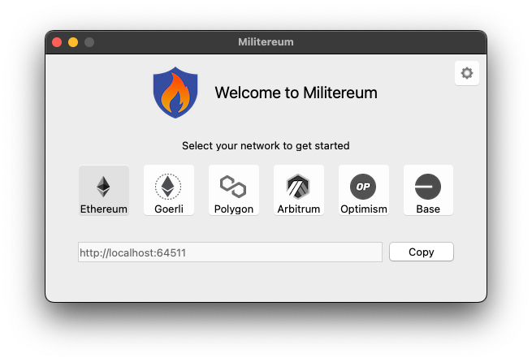
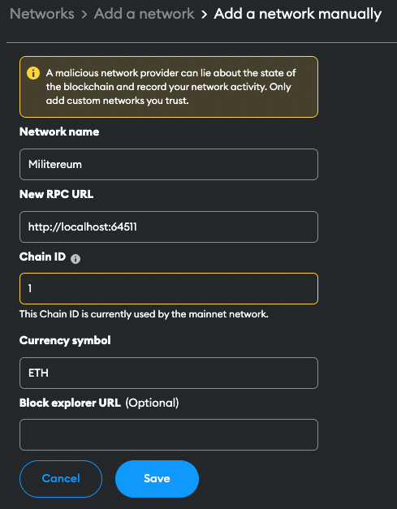
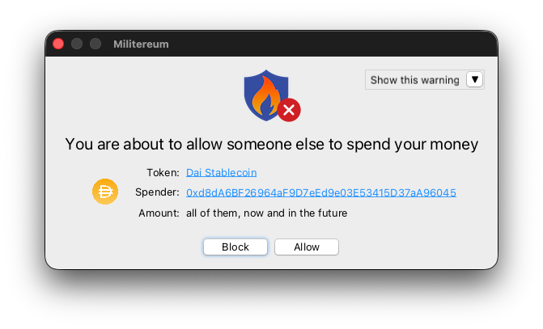

#  Militereum&nbsp;&nbsp;  

* blocks suspicious transactions
* works with every EVM-compatible wallet, including browser-based and native desktop wallets
* no cookie warnings, no ads
* not susceptible to phishing (there is no web site to visit)
* not susceptible to copycat extensions (there is no browser extension)
* supports Ethereum and many other chains, including [Polygon](https://polygon.technology/) and [Arbitrum](https://arbitrum.io/) and [Optimism](https://optimism.io/)
* available for [Windows](https://github.com/svanas/Militereum/releases/latest/download/Windows.zip) and [macOS](https://github.com/svanas/Militereum/releases/latest/download/macOS.zip)

| | Militereum | [Harpie](https://harpie.io/) | [Fire](https://www.joinfire.xyz/) | [Pocket Universe](https://www.pocketuniverse.app/) | [Stelo](https://stelolabs.com/) | [Eagle RPC](https://twitter.com/harpieio/status/1615454753672286209) | [Blowfish Protect](https://extension.blowfish.xyz/) | [Nefture](https://www.nefture.com/) |
|-|:-:|:-:|:-:|:-:|:-:|:-:|:-:|:-:|
| works with browser-based wallets ([MetaMask](https://metamask.io/), [Trust](https://trustwallet.com/), etc)       | ✅ | ✅ | ✅ | ✅ | ✅ | ✅ | ✅ | ✅ |
| works with native desktop wallets ([Frame](https://frame.sh/), [Zerion](https://link.zerion.io/a11o6IN0jqb), etc) | ✅ | ✅ | ❌ | ❌ | ❌ | ✅ | ❌ | ✅ |
| blocks transactions BEFORE they leave your device                                                                 | ✅ | ❌ | ✅ | ✅ | ✅ | ✅ | ✅ | ✅ |
| 100% uptime (there is no remote server)                                                                           | ✅ | ❌ | ✅ | ✅ | ✅ | ❌ | ✅ | ❌ |
| auditable open source code                                                                                        | ✅ | ❌ | ❌ | ✅ | ✅ | ❌ | ❌ | ❌ |

## Setup

1. Download Militereum for [Windows](https://github.com/svanas/Militereum/releases/latest/download/Windows.zip) or [macOS](https://github.com/svanas/Militereum/releases/latest/download/macOS.zip)
2. Launch Militereum. The following window appears. Click on `Copy`

3. Unlock MetaMask in your web browser
4. Navigate to _Settings_ > _Networks_ > _Add a network manually_
5. The following tab appears. Paste Militereum's network URL in `New RPC URL`. Click on `Save`

Click [here](networks.md) for more info on how to configure Militereum.

## Running

As soon as your wallet has connected to Militereum, the firewall gets minimized and keeps running in the background.

Every raw transaction passes through Militereum and if it is suspicious, Militereum will block the transaction and prevent it from leaving your device.

Here's an example. Navigate to [Uniswap](https://app.uniswap.org/) or [Balancer](https://app.balancer.fi/). Initiate a swap from one of your tokens to another. Before Uniswap or Balancer can swap your token, you'll need to sign a so-called _token allowance_.

Every time you approve a token allowance, you are potentially exposing your wallet to an exploit. Uniswap and Balancer are very reputable, but any other dapp can potentially phish you for an allowance and drain your tokens from your wallet.

After your crypto wallet has approved the allowance, Militereum will intercept the transaction and prompt you with this window. From here, you can allow the transaction to happen, or prevent it from leaving your device.

Besides token allowances, Militereum will block...
1. monetary transfers above $5k [➹](assets/limit.png), and
2. transactions to a sanctioned address [➹](assets/sanctioned.png), and
3. transactions to a smart contract that has not been [etherscan](https://etherscan.io/)-verified [➹](assets/unverified.png), and
4. transactions to an address you have not transacted with before [➹](assets/firsttime.png), and
5. transfers of non-transferable tokens that are designed to pump but you cannot sell [➹](assets/untransferable.png), and
6. deposits to a [metamorphic smart contract](https://0age.medium.com/the-promise-and-the-peril-of-metamorphic-contracts-9eb8b8413c5e) that could be updated to divert your money elsewhere.

## License

Distributed under the [GNU AGP v3.0](https://github.com/svanas/Militereum/blob/master/LICENSE) with [Commons Clause](https://commonsclause.com/) license.

## Sponsors

This project received a [WAGBI grant](https://www.alchemy.com/developer-grant-program) from alchemy.com and is featured in [Alchemy’s Dapp Store](https://www.alchemy.com/dapps/militereum).

## Disclaimer

Militereum is provided free of charge. There is no warranty. The authors do not assume any responsibility for bugs, vulnerabilities, or any other technical defects. Use at your own risk.
