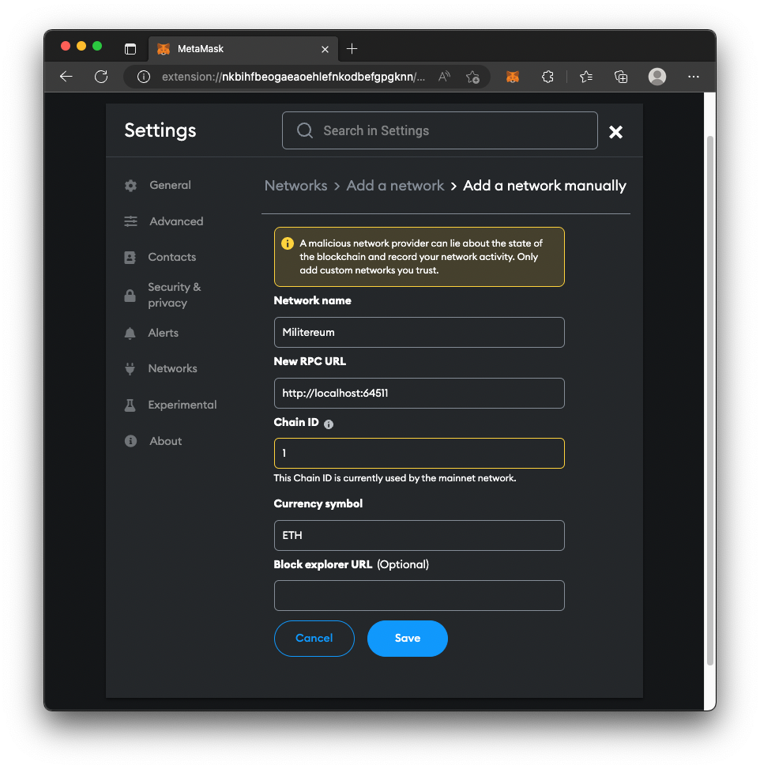
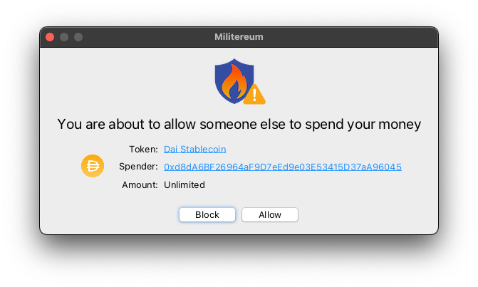

#  Militereum&nbsp;&nbsp;   

* simulates your transactions
* shows you exactly what tokens are about to exit your wallet BEFORE a transaction leaves your device
* blocks suspicious transactions
* works with every EVM-compatible wallet, including browser-based (eg. [MetaMask](https://metamask.io/), [Trust](https://trustwallet.com/)) and native desktop (eg. [Frame](https://frame.sh/), [Zerion](https://link.zerion.io/a11o6IN0jqb)) wallets
* non-custodial, 100% uptime. you do not depend on our servers because there aren't any
* supports Ethereum and many other chains, including [Polygon](https://polygon.technology/) and [Arbitrum](https://arbitrum.io/) and [Optimism](https://optimism.io/) and [Base](https://base.org/)
* available for [Windows](https://apps.microsoft.com/detail/9nv0c48z57r4) and [macOS](https://apps.apple.com/app/militereum/id6446287995)
* auditable open source code

## Reason to be

Almost everybody in crypto — especially those who are in DeFi — has been phished, drained, hacked, or rug pulled. Wallets are keepers of keys, but they don’t necessarily keep you safe. If the crypto ecosystem ever wants to reach mass adoption, this has to change. Militereum is a web3 firewall that once installed secures your crypto holdings. Militereum is chain-agnostic and works with every crypto wallet, including browser-based and native desktop wallets. Each and everyone of your transactions is simulated and potentially blocked if Militereum thinks it is unsafe. Because Militereum is rooted into your operating system, the software can start automatically when you log into your device, and wallets or dapps cannot bypass it.

## Setup

1. Download Militereum for [Windows](https://apps.microsoft.com/detail/9nv0c48z57r4) or [macOS](https://apps.apple.com/app/militereum/id6446287995)
2. Launch Militereum. The following window appears. Click on `Copy`

3. Unlock MetaMask in your web browser
4. Navigate to _Settings_ > _Networks_ > _Add a network manually_
5. The following tab appears. Paste Militereum's network URL in `New RPC URL`. Click on `Save`

Click [here](networks.md) for more info on how to configure Militereum.

## Running

As soon as your wallet has connected to Militereum, the firewall gets minimized and keeps running in the background.

Every raw transaction passes through Militereum and if it is suspicious, Militereum will block the transaction and prevent it from leaving your device.

Here's an example. Navigate to [Uniswap](https://app.uniswap.org/) or [Balancer](https://app.balancer.fi/). Initiate a swap from one of your tokens to another. Before Uniswap or Balancer can swap your token, you'll need to sign a so-called _token allowance_.

Every time you approve a token allowance, you are potentially exposing your wallet to an exploit. Uniswap and Balancer are very reputable, but any other dapp can potentially phish you for an allowance and drain your tokens from your wallet.

After your crypto wallet has approved the allowance, Militereum will intercept the transaction and prompt you with this window. From here, you can allow the transaction to happen, or prevent it from leaving your device.

Besides token allowances, Militereum will block...
1. you transferring [more than 5k in US dollars](assets/limit.png)
2. you transacting with [a sanctioned address](assets/sanctioned.png)
3. you transacting with [a smart contract that has not been verified](assets/unverified.png)
4. you transacting with [an address you have not transacted with before](assets/firsttime.png) (this warning will stop most phishing attacks)
5. you transacting with [an address that has been identified as a phisher](assets/phisher.png)
6. you transacting with [a dormant contract where the last transaction with the smart contract was more than 30 days ago](assets/dormant.png)
7. you trusting someone else to be able to [transfer all your NFTs out of your wallet](assets/setApprovalForAll.png)
8. you buying [a suspicious token that is probably an unwarranted airdrop](assets/airdrop.png)
9. you buying [a token that lies about its own token supply](assets/spam.png)
10. you buying [a honeypot token that is designed to pump but you cannot sell](assets/honeypot.png)
11. you buying [a token that is unsupported by Uniswap](assets/unsupported.png)
12. you buying [a censorable token that can blacklist you](assets/censorable.png)
13. you buying [a pausable token that can prevent you from swapping or selling](assets/pausable.png)
14. you buying [a token with an unlock event coming up within 3 months](assets/unlock.png), inflating the supply and possibly decreasing the price
15. you receiving [a token without a DEX pair](assets/noDexPair.png) that you won't have the option to sell
16. you receiving [a low-DEX-score token](assets/lowDexScore.png) that has little or no liquidity
17. you depositing money into a [metamorphic smart contract](https://0age.medium.com/the-promise-and-the-peril-of-metamorphic-contracts-9eb8b8413c5e) that could be updated to divert your money elsewhere.

Militereum's warnings are provided for informational purposes only and should not be taken as financial advice. Remember to always do your own research before interacting with tokens.

## License

Distributed under the [GNU AGP v3.0](https://github.com/svanas/Militereum/blob/master/LICENSE) with [Commons Clause](https://commonsclause.com/) license.

## Sponsors

This project received a [WAGBI grant](https://www.alchemy.com/developer-grant-program) from alchemy.com and is featured in [Alchemy’s Dapp Store](https://www.alchemy.com/dapps/militereum).

## Disclaimer

Militereum is provided free of charge. There is no warranty. The authors do not assume any responsibility for bugs, vulnerabilities, or any other technical defects. Use at your own risk.
