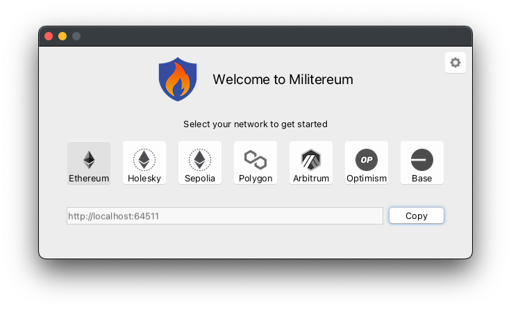

#  Militereum&nbsp;&nbsp;  

* blocks suspicious transactions
* works with every EVM-compatible wallet, including browser-based _and_ desktop wallets
* no cookie warnings, no ads
* not susceptible to fishing (there is no web site to visit)
* not susceptible to copycat extensions (there is no browser extension)
* supports Ethereum and many other chains, including [Polygon](https://polygon.technology/) and [Arbitrum](https://arbitrum.io/) and [Optimism](https://optimism.io/)
* available for [Windows](https://github.com/svanas/Militereum/releases/latest/download/Windows.zip) and [macOS](https://github.com/svanas/Militereum/releases/latest/download/macOS.zip)

| | Militereum | [Harpie](https://harpie.io/) | [Fire](https://www.joinfire.xyz/) | [Pocket Universe](https://www.pocketuniverse.app/) | [Stelo](https://stelolabs.com/) |
|-|:-:|:-:|:-:|:-:|:-:|
| works with browser-based wallets ([MetaMask](https://metamask.io/), [Trust](https://trustwallet.com/), etc) | ✅ | ✅ | ✅ | ✅ | ✅ |
| works with desktop wallets ([Frame](https://frame.sh/), [Zerion](https://zerion.io/), etc)                  | ✅ | ✅ | ❌ | ❌ | ❌ |
| blocks transactions BEFORE they leave your device                                                           | ✅ | ❌ | ✅ | ✅ | ✅ |

## Setup

1. Download Militereum for [Windows](https://github.com/svanas/Militereum/releases/latest/download/Windows.zip) or [macOS](https://github.com/svanas/Militereum/releases/latest/download/macOS.zip)
2. Launch Militereum. The following window appears. Click on `Copy`

3. Unlock MetaMask in your web browser
4. Navigate to _Settings_ > _Networks_ > _Add a network manually_
5. The following tab appears. Paste Militereum's network URL in `New RPC URL`. Click on `Save`

## Running

As soon as your wallet has connected to Militereum, the firewall gets minimized and keeps running in the background.

Every raw transaction passes through Militereum and if it is suspicious, Militereum will block the transaction and prevent it from leaving your device.

Here's an example. Navigate to [Uniswap](https://app.uniswap.org/) or [Balancer](https://app.balancer.fi/). Initiate a swap from one of your tokens to another. Before Uniswap or Balancer can swap your token, you'll need to sign a so-called _token allowance_.

Every time you approve a token allowance, you are potentially exposing your wallet to an exploit. Uniswap and Balancer are very reputable, but any other dapp can potentially fish you for an allowance and drain your tokens from your wallet.

After your crypto wallet has approved the allowance, Militereum will intercept the transaction and prompt you with this window. From here, you can allow the transaction to happen, or prevent it from leaving your device.

Besides token allowances, Militereum will block...
1. monetary transfers above $5k, and
2. transactions to a sanctioned address [➹](assets/sanctioned.png), and
3. transactions to a smart contract that has not been [etherscan](https://etherscan.io/)-verified [➹](assets/unverified.png), and
4. deposits to a smart contract with an admin key that can pause the contract, and
5. deposits to a [metamorphic smart contract](https://0age.medium.com/the-promise-and-the-peril-of-metamorphic-contracts-9eb8b8413c5e) that could be updated to divert your money elsewhere.

## Middleware

In addition to a firewall, Militereum provides the following custom JSON-RPC methods to supporting wallets:

| method                   | description |
|--------------------------|-------------|
| `eth_isTaintedToken`     | Detect tainted tokens in your wallet, and report the reason why the tokens are high risk (for example: if the sender is sanctioned). 
| `eth_previewTransaction` | Preview the expected outcome of your transactions (based upon the current state of the blockchain) before the transaction leaves your device. This should help reduce transaction anxiety and prevent unintended consequences.
| `eth_getTokenApy`        | Return the annual percentage yield you are earning on your tokens (if any).
| `eth_isDeprecatedToken`  | If you own LP tokens from outdated DeFi protocols that have been replaced with never versions (for example: Aave v1) or yield aggregators that aren’t boosted anymore (for example: Yearn vaults v1), this method will alert you.

_more custom JSON-RPC methods are in the works._

## License

Distributed under the [GNU AGP v3.0](https://github.com/svanas/Militereum/blob/master/LICENSE) with [Commons Clause](https://commonsclause.com/) license.

## Disclaimer

Militereum is provided free of charge. There is no warranty. The authors do not assume any responsibility for bugs, vulnerabilities, or any other technical defects. Use at your own risk.
